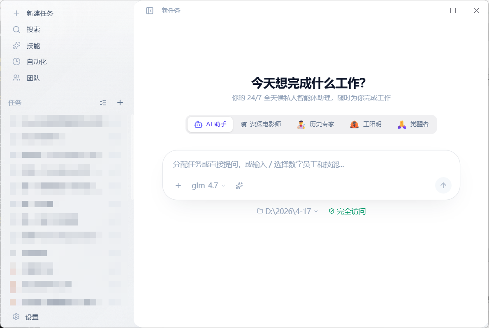
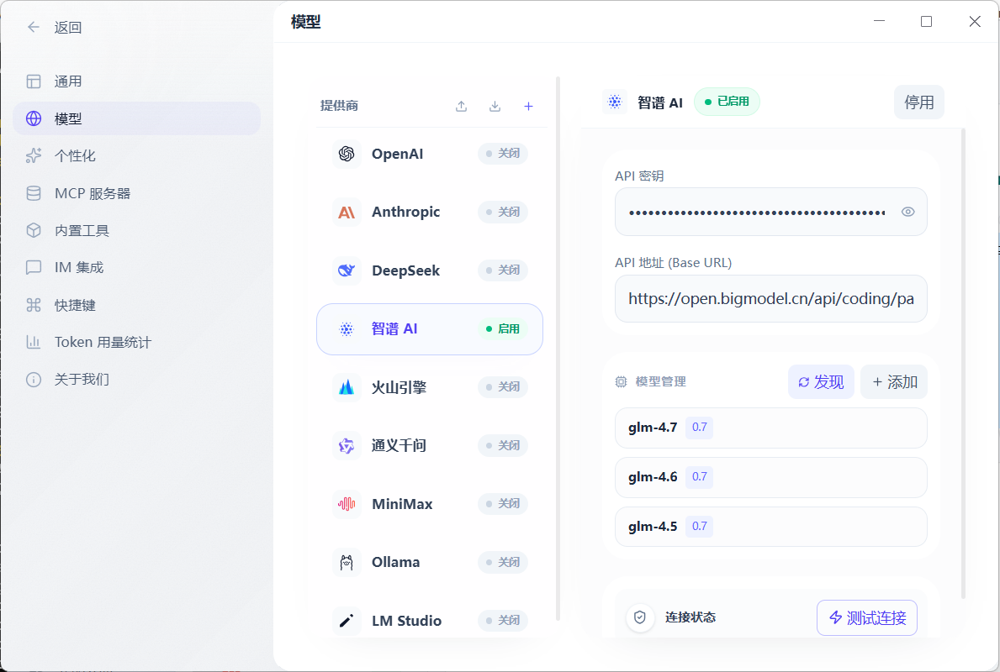
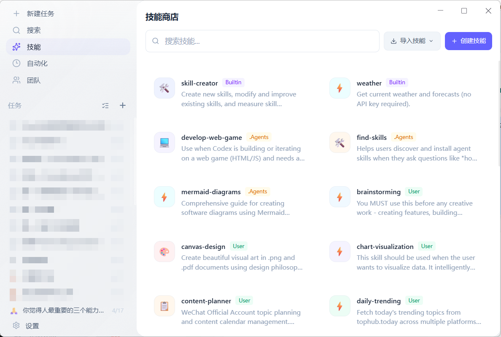
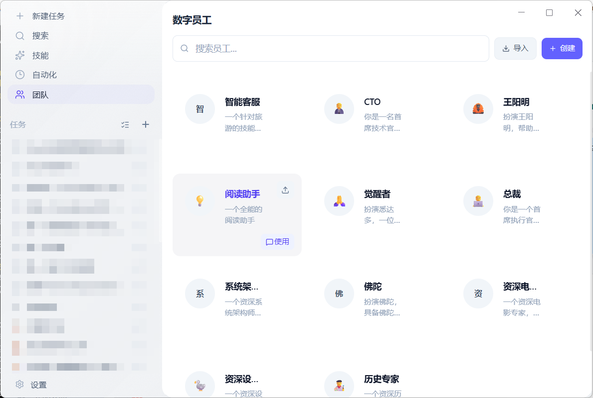

# Geni

[English](#english) | [中文](#中文)

---

## English

> **An AI collaborative workspace that can actually work with your local environment**
> *Chat, tools, skills, MCP, digital staff, and automation in one desktop app.*

Geni is an Electron desktop app for people who want more than a browser chat box. It combines AI chat, local tools, MCP integrations, reusable skills, scheduled tasks, and customizable AI staff into one workspace, so you can move from asking to doing without constantly switching apps.

## Why Geni

- **Works with your real workflow**: Read files, edit content, search code, run commands, fetch web pages, manage todos, and automate recurring work.
- **Built for agentic use cases**: Geni uses a three-layer agent architecture with a ReAct loop at the core, making it suitable for assistants that think, act, observe, and continue.
- **Extensible by design**: Add MCP servers, built-in tools, and markdown-based skills without changing the whole app.
- **More than one assistant**: Create digital staff with different prompts, skills, and model choices for different jobs.
- **Desktop-first experience**: Keep your workspace, settings, and local integrations close to the work you are doing.

## Good Fits

Geni is a strong fit if you want to:

- Use AI on top of local files and tools, not only text chat
- Build a personal AI workspace with reusable skills and automation
- Experiment with MCP-powered workflows
- Run multiple specialized AI personas for different tasks
- Explore agent architecture inside a real desktop app

## Quick Start

### Prerequisites

- Node.js 18+
- npm

### Install

1. Clone the repository:

   ```bash
   git clone https://gitee.com/jacksmion/cowork.git
   cd cowork
   ```

2. (Optional) Use an Electron mirror if downloads are slow, especially in mainland China:

   - **Windows (PowerShell)**

     ```powershell
     $env:ELECTRON_MIRROR="https://npmmirror.com/mirrors/electron/"
     ```

   - **macOS / Linux**

     ```bash
     export ELECTRON_MIRROR="https://npmmirror.com/mirrors/electron/"
     ```

3. Install dependencies:

   ```bash
   npm install
   ```

4. Start the app:

   ```bash
   npm run dev
   ```

### First Run

After the app opens, the shortest path to a working setup is:

1. Open **Settings**.
2. Go to **Model Settings**.
3. Add at least one provider configuration with an API key.
4. Select or enable a model.
5. Return to chat and start a session.

If you want deeper integrations after that:

- Add MCP servers in **MCP Settings**
- Enable or disable built-in tools in **Tool Settings**
- Install or manage skills in **Skill Settings**
- Create role-based assistants in **Digital Staff**

## What You Can Do

### 1. AI chat that can use tools

Geni is designed for work that needs action, not just answers. The built-in tools cover file operations, shell execution, web access, memory, todos, and automation.

### 2. MCP-powered extensions

You can connect MCP servers to expand what the assistant can access and do, while keeping the tool model consistent with the rest of the app.

### 3. Skills as reusable knowledge capsules

Skills are markdown-based, lazily loaded knowledge packs. They help agents perform specialized tasks without hardcoding every workflow.

### 4. Digital staff for specialized roles

Instead of one general-purpose assistant, you can create staff profiles with different prompts, allowed tools, skills, and model settings.

### 5. Scheduled and IM-connected workflows

Geni supports cron-based automation and IM integrations including Telegram, WeCom, Lark, and WeChat for workflows that need notifications or remote triggers.

## Screenshots

### Chat Workspace

The main workspace for conversations, tool use, and task execution.



### Settings

Configure models, tools, MCP servers, and application behavior.



### Skills

Manage specialized skill capsules that expand what agents can do.



### Digital Staff

Create AI teammates with different roles, prompts, and capabilities.



## Core Commands

| Command | Description |
|---------|-------------|
| `npm run dev` | Start the development app |
| `npm run build` | Type-check and build for production |
| `npm run test` | Run all Vitest tests |
| `npm run test:watch` | Run tests in watch mode |
| `npm run lint` | Run ESLint |
| `npm run lint:fix` | Auto-fix ESLint issues |
| `npm run pack` | Build unpacked Electron output |
| `npm run dist` | Build distributable packages |
| `npm run dist:win` | Build Windows packages |
| `npm run dist:mac` | Build macOS packages |
| `npm run dist:linux` | Build Linux packages |

Run a single test file:

```bash
npx vitest run tests/path/to/test.test.ts
```

## Architecture At A Glance

Geni uses a **Three-Layer Agent Architecture**:

```text
┌─────────────────────────────────────────────────────────────┐
│ Agent (Config Layer) - id, name, modelId, systemPrompt,    │
│ skillIds, allowedTools                                     │
├─────────────────────────────────────────────────────────────┤
│ AgentRuntime - lifecycle, skill loading, tool filtering,   │
│ history management, prompt assembly                        │
├─────────────────────────────────────────────────────────────┤
│ ReActExecutor - think/act/observe loop, LLM calls,         │
│ tool execution, context compression                        │
└─────────────────────────────────────────────────────────────┘
```

High-level system layers:

- **Trigger Layer**: Scheduler and IM adapters
- **Application Layer**: IPC controllers
- **Agent Kernel**: Runtime, executor, prompt builder, tool guard
- **Cognitive Layer**: Unified LLM interface
- **Capability Layer**: Tools and skills
- **Infrastructure Layer**: Storage, config, and system services

## Project Structure

```text
geni/
├── src/
│   ├── common/                # Shared types, IPC channels, i18n
│   ├── main/                  # Electron main process
│   │   ├── controllers/       # IPC request handlers
│   │   └── services/
│   │       ├── agent/         # Agent runtime + executor
│   │       ├── tools/         # Built-in tools and MCP adapters
│   │       ├── skills/        # Skill loading and registry
│   │       ├── llm/           # Provider adapters
│   │       ├── staff/         # Digital staff
│   │       ├── scheduler/     # Automation
│   │       └── im/            # IM integrations
│   └── renderer/              # React UI
│       ├── modules/           # Feature modules
│       ├── pages/             # Full pages
│       └── store/             # Zustand stores
├── skills/                    # Built-in skills
│   ├── brainstorming/
│   ├── frontend-design/
│   ├── skill-creator/
│   ├── systematic-debugging/
│   ├── weather/
│   └── writing-plans/
├── docs/                      # Product, architecture, and planning docs
└── tests/                     # Vitest tests
```

## Tech Stack

| Category | Technology |
|----------|------------|
| Core | Electron 40, React 19, TypeScript 5.9 |
| Build Tool | Vite 7 |
| Styling | Tailwind CSS v4 |
| State Management | Zustand |
| AI Integration | MCP SDK, Anthropic SDK, OpenAI SDK |
| Testing | Vitest |

## License

This project is released under the [Business Source License 1.1](LICENSE).

- Free for personal use, academic research, teaching, evaluation, and internal use by non-profit organizations
- Commercial use requires a separate license
- Commercial licensing contact: [@jacksmion on X](https://x.com/jacksmion)
- Change Date: `2029-06-18`
- Change License: `Apache License 2.0`

In short: you can study the source and use it in the allowed non-commercial scenarios today, but it is not an OSI-approved open source license before the change date.

---

## 中文

> **真正能接入本地环境的 AI 协作工作台**
> *把聊天、工具、技能、MCP、数字员工和自动化放进同一个桌面应用。*

Geni 是一款面向本地工作流的 Electron 桌面应用，不只是一个浏览器里的 AI 聊天框。它把 AI 对话、系统工具、MCP 集成、可复用技能、定时任务和可定制的数字员工整合进同一个工作空间里，让你可以从“提问”自然走到“执行”。

## 为什么用 Geni

- **贴近真实工作流**：可以围绕本地文件、代码、命令行、网页、待办和自动化任务开展协作，而不只是纯文本问答。
- **天然适合 Agent 场景**：底层采用三层 Agent 架构，以 ReAct 循环为核心，适合需要思考、行动、观察和继续迭代的助手工作流。
- **扩展能力强**：支持 MCP Server、内置工具和 markdown 技能体系，不需要推翻整体架构就能增加能力。
- **不止一个助手**：你可以为不同任务创建不同的数字员工，分别配置提示词、技能和模型。
- **桌面优先体验**：本地工作区、设置和系统集成都离你的真实工作更近。

## 适合谁

如果你有下面这些需求，Geni 会比较合适：

- 希望 AI 能直接配合本地文件和工具工作
- 想搭建一个带技能和自动化能力的个人 AI 工作台
- 想尝试 MCP 驱动的工作流
- 想让多个不同职责的 AI 角色分工协作
- 想研究一个真实桌面应用中的 Agent 架构实现

## 快速开始

### 环境要求

- Node.js 18+
- npm

### 安装

1. 克隆仓库：

   ```bash
   git clone https://gitee.com/jacksmion/cowork.git
   cd cowork
   ```

2. 如果 Electron 下载较慢，可选配置镜像，推荐中国大陆用户使用：

   - **Windows（PowerShell）**

     ```powershell
     $env:ELECTRON_MIRROR="https://npmmirror.com/mirrors/electron/"
     ```

   - **macOS / Linux**

     ```bash
     export ELECTRON_MIRROR="https://npmmirror.com/mirrors/electron/"
     ```

3. 安装依赖：

   ```bash
   npm install
   ```

4. 启动应用：

   ```bash
   npm run dev
   ```

### 首次运行

应用打开后，建议按这个最短路径完成可用配置：

1. 打开 **Settings**
2. 进入 **Model Settings**
3. 添加至少一个模型提供商配置和 API Key
4. 启用并选择一个模型
5. 返回聊天页开始新会话

如果你想继续扩展能力，可以再做这些事：

- 在 **MCP Settings** 里添加 MCP Server
- 在 **Tool Settings** 里启用或限制内置工具
- 在 **Skill Settings** 里安装或管理技能
- 在 **Digital Staff** 里创建分工明确的 AI 角色

## 你可以用它做什么

### 1. 让 AI 不只是聊天，而是真的动手

Geni 的内置工具覆盖文件读写、命令执行、网页访问、记忆、待办和自动化，适合需要“边聊边做”的场景。

### 2. 通过 MCP 接入更多能力

你可以接入 MCP Server 扩展助手的能力边界，同时保持统一的工具调用方式。

### 3. 用技能沉淀可复用工作方法

技能是 markdown 形式的知识胶囊，按需加载，适合把代码评审、规划、调试等方法沉淀下来复用。

### 4. 创建不同分工的数字员工

你不必只维护一个通用助手，可以为写作、编码、调度、研究等不同任务创建专门角色。

### 5. 做定时和 IM 联动的自动化

Geni 支持基于 cron 的自动任务，以及 Telegram、企业微信、飞书、微信等 IM 集成，适合通知和远程触发类场景。

## 界面预览

### 聊天工作区

主要工作界面，用于对话、工具调用和任务执行。


### 设置

统一配置模型、工具、MCP Server 和应用行为。


### 技能

管理用于扩展 Agent 能力的技能胶囊。


### 数字员工

创建具备不同职责、提示词和能力边界的 AI 协作者。


## 常用命令

| 命令 | 说明 |
|------|------|
| `npm run dev` | 启动开发环境 |
| `npm run build` | 类型检查并构建生产版本 |
| `npm run test` | 运行全部 Vitest 测试 |
| `npm run test:watch` | 监听模式运行测试 |
| `npm run lint` | 执行 ESLint 检查 |
| `npm run lint:fix` | 自动修复 ESLint 问题 |
| `npm run pack` | 构建未打包 Electron 产物 |
| `npm run dist` | 构建发行包 |
| `npm run dist:win` | 构建 Windows 包 |
| `npm run dist:mac` | 构建 macOS 包 |
| `npm run dist:linux` | 构建 Linux 包 |

单独运行某个测试文件：

```bash
npx vitest run tests/path/to/test.test.ts
```

## 架构概览

Geni 采用 **三层 Agent 架构**：

```text
┌─────────────────────────────────────────────────────────────┐
│ Agent（配置层）- id, name, modelId, systemPrompt,          │
│ skillIds, allowedTools                                     │
├─────────────────────────────────────────────────────────────┤
│ AgentRuntime（运行时）- 生命周期、技能加载、工具过滤、     │
│ 历史管理、提示词组装                                       │
├─────────────────────────────────────────────────────────────┤
│ ReActExecutor（执行器）- Think / Act / Observe 循环、      │
│ LLM 调用、工具执行、上下文压缩                             │
└─────────────────────────────────────────────────────────────┘
```

系统可粗略分为这些层次：

- **触发层**：Scheduler 与 IM 适配器
- **应用层**：IPC Controller
- **Agent 内核**：Runtime、Executor、PromptBuilder、ToolGuard
- **认知层**：统一的 LLM 抽象接口
- **能力层**：Tools 与 Skills
- **基础设施层**：存储、配置与系统服务

## 项目结构

```text
geni/
├── src/
│   ├── common/                # 共享类型、IPC、i18n
│   ├── main/                  # Electron 主进程
│   │   ├── controllers/       # IPC 请求处理
│   │   └── services/
│   │       ├── agent/         # Agent runtime + executor
│   │       ├── tools/         # 内置工具与 MCP 适配
│   │       ├── skills/        # 技能加载与注册
│   │       ├── llm/           # 模型适配层
│   │       ├── staff/         # 数字员工
│   │       ├── scheduler/     # 自动化调度
│   │       └── im/            # IM 集成
│   └── renderer/              # React 界面
│       ├── modules/           # 功能模块
│       ├── pages/             # 页面级组件
│       └── store/             # Zustand 状态仓库
├── skills/                    # 内置技能
│   ├── brainstorming/
│   ├── frontend-design/
│   ├── skill-creator/
│   ├── systematic-debugging/
│   ├── weather/
│   └── writing-plans/
├── docs/                      # 产品、架构和规划文档
└── tests/                     # Vitest 测试
```

## 技术栈

| 类别 | 技术 |
|------|------|
| 核心 | Electron 40, React 19, TypeScript 5.9 |
| 构建工具 | Vite 7 |
| 样式 | Tailwind CSS v4 |
| 状态管理 | Zustand |
| AI 集成 | MCP SDK, Anthropic SDK, OpenAI SDK |
| 测试 | Vitest |

## 许可证

本项目采用 [Business Source License 1.1](LICENSE)。

- 个人使用、学术研究、教学评估、非营利组织内部使用免费
- 商业使用需要单独授权
- 商业授权联系：[@jacksmion on X](https://x.com/jacksmion)
- 转换日期：`2029-06-18`
- 转换后协议：`Apache License 2.0`

简单理解：你现在可以阅读源码并在许可允许的非商业场景下使用它，但在转换日期之前，它还不是 OSI 认可的开源许可证。
