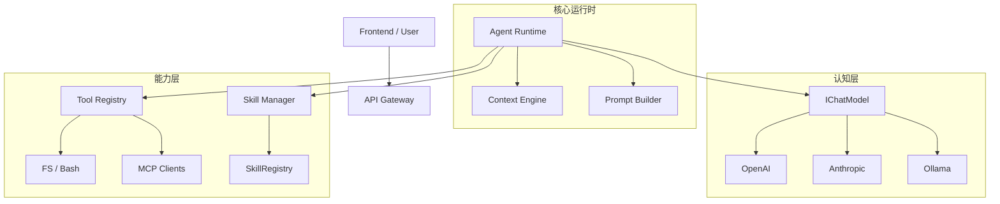

# Agent 架构重构与 Skill 系统演进方案 (v2.0)

本文档基于对当前 `services` 架构的深度分析，结合 **Claude Skills** 的设计理念，旨在构建一个高内聚、低耦合、具备强扩展性的 Agent 核心架构。

## 1. 现状主要问题 (Critical Issues)

### 1.1 核心运行时缺陷
- **并行工具调用失效 (Parallel Function Call Bug)**: `OpenAIAgentService` 当前的流式解析逻辑（`toolCallBuffer`）无法处理 OpenAI 返回的并行工具调用（同时返回多个 tool_calls），会导致多步操作丢失或参数解析错误。
- **上帝类 (God Class) 倾向**: `OpenAIAgentService` 耦合了 API 调用、Prompt 拼接、历史记录裁剪、工具执行监听等所有逻辑，违反单一职责原则。

### 1.2 架构耦合度高
- **LLM 强绑定**: 直接依赖 `openai` SDK，难以平滑切换至 Claude 3.5 Sonnet（编程能力更强）或 DeepSeek（成本更低）。
- **无状态设计**: 缺乏 `Session` 和 `Context` 的持久化管理对象，每次 `run` 都是一次性的，无法维护“工作区上下文”或“跨轮次记忆”。

### 1.3 Skill 系统定义模糊
- 当前代码混淆了 **Atomic Tool (原子工具)** 和 **Skill (能力胶囊)** 的调用方式。Skill 被注册为 Function，但实际上通过 `read_skill` 以知识文档形式被消费。

---

## 2. 目标架构设计 (To-Be Architecture)

引入 **分层架构 (Layered Architecture)**，将 Agent 拆解为认知层、核心层和能力层。



### 2.1 核心组件职责
| 组件 | 职责 |
| :--- | :--- |
| **Agent Kernel** | 负责 ReAct 循环 (Think-Act-Observe)，管理状态机。 |
| **Context Engine** | 基于 Token 预算管理历史记录，动态注入环境信息、文件内容摘要。 |
| **Cognitive Layer** | 屏蔽模型差异 (OpenAI/Claude)，统一流式输出格式。 |
| **Capability Layer** | 管理硬能力 (Tools) 和 软能力 (Skills)。 |

---

## 3. Deep Dive: Skill 系统 (Claude Skills 对齐)

### 3.1 定义：什么是 Skill？
在我们的系统中，Skill 与 Claude Skills 理念一致，是 **"可插拔的知识胶囊"**。
- **性质**: 它不是直接执行的代码函数 (Function)，而是 **标准化作业程序 (SOP)**、**专家经验**、**Prompt 模板**的集合。
- **作用**: 让 Agent 在面对特定任务（如“重构代码”、“编写测试”）时，能临时“下载”专家的思维模式。
- **消费模式**: **Lazy Loading (懒加载)**。System Prompt 只包含技能目录，Agent 按需通过 `read_skill` 调取完整内容到上下文。

### 3.2 目录结构规划
为支持复杂的 Skill 管理，并明确区分“硬能力(Tools)”与“软能力(Skills)”，建议采用平级目录结构：

```text
src/main/services/
├── agent/                  # [Kernel Layer] 核心运行时
│   ├── AgentRuntime.ts     # 替代原 OpenAIAgentService，负责 ReAct 循环
│   ├── ContextManager.ts   # 负责 Token 计数与历史记录裁剪
│   ├── PromptBuilder.ts    # 负责组装 System Prompt (Persona + Skills + Tools)
│   └── state/              # 状态机 (Idle, Thinking, ToolExecuting)
├── llm/                    # [Cognitive Layer] 认知适配层
│   ├── IChatModel.ts       # 统一接口 (stream, countTokens)
│   └── providers/          # 具体实现 (OpenAI, Anthropic, Ollama)
├── tools/                  # [Capability Layer - Hard] 原子工具
│   ├── core/               # 原生工具 (FS, Bash) -> 纯代码逻辑
│   ├── mcp/                # MCP 协议适配
│   └── ToolRegistry.ts     # 工具注册与执行
├── skills/                 # [Capability Layer - Soft] 专家技能
│   ├── core/
│   │   ├── SkillRegistry.ts      # 技能注册中心 (元数据管理)
│   │   ├── SkillLifecycle.ts     # 加载/卸载逻辑
│   │   └── SkillParser.ts        # 解析 SKILL.md
│   ├── runtime/
│   │   └── SkillReader.ts        # 负责将 Skill 内容注入 Context (原 SkillReaderTool)
│   └── repository/               
│       └── LocalSkillSource.ts   # 扫描 .cursor/skills 目录
└── session/                # [Infrastructure Layer] 会话状态
    └── SessionManager.ts   # 管理多 Tab 会话状态
```

### 3.3 交互流程 (The Skill Loop)
1. **Discovery**: Agent 在 System Prompt 中看到 `Available Skills: [git-expert, react-refactor, ...]`.
2. **Intent**: Agent 遇到复杂 Git 冲突，决定使用 `git-expert`。
3. **Acquisition**: Agent 调用 `read_skill('git-expert')`.
4. **Injection**: `SkillContextInjector` 读取 `SKILL.md`，将其作为 `<system_note>` 注入到当前对话上下文。
5. **Execution**: Agent 遵循 Skill 中的 SOP (如：先 fetch，再 check branch，最后 merge) 指导后续的 Tool 调用。

---

## 4. 实施路线图 (Implementation Roadmap)

### Phase 1: 止血与修复 (P0)
- **Fix**: 修复 `OpenAIAgentService.ts` 中的并行工具调用 (Parallel Function Call) Bug。这是 Agent 变聪明的关键。
- **Refactor**: 简单的代码拆分，将 Prompt 拼接逻辑提取到 `PromptBuilder`。

### Phase 2: 认知抽象 (P1)
- **Feature**: 定义 `IChatModel` 接口。
- **Feature**: 实现 `OpenAIAdapter` 和 `AnthropicAdapter`。
- **Benefit**: 能够切换到 Claude 3.5 Sonnet，利用其更强的 Coding 能力和原生 Skill 理解能力。

### Phase 3: Skill 系统增强 (P2)
- **Feature**: 建立 `skills/core/` 目录结构。
- **Feature**: 实现 `SkillRegistry` 的语义检索 (不仅靠名字匹配，未来可支持 Embedding 检索)。
- **Feature**: 规范化 `SKILL.md` 标准，支持参数化 Prompt。

### Phase 4: 上下文引擎 (P3)
- **Feature**: 实现基于 Token 的滑动窗口 (Token Sliding Window)。
- **Feature**: 引入摘要机制 (Summarization)，防止长对话遗忘。

## 5. 结论
目前的系统是一个优秀的 MVP。通过引入 **Layered Architecture** 和 **First-class Skill System**，我们将把一个“能运行的脚本”转变为一个“可扩展的智能平台”。首要任务是修复并行调用问题，随即开始架构分层。
