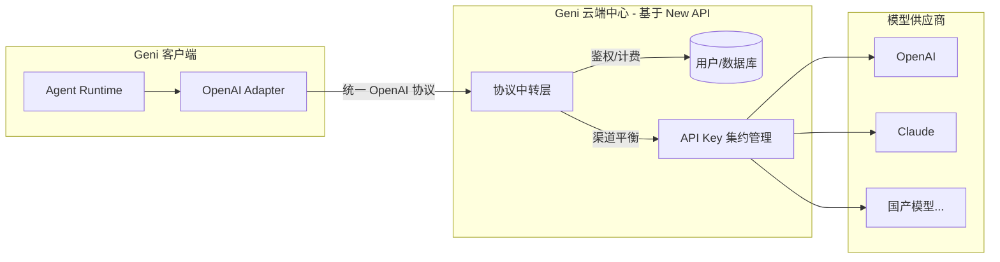

# Geni 订阅制模式技术方案文档

> **版本**: 1.0 (草案)
> **状态**: 方案设计阶段
> **目标**: 将 Geni 从客户端直连模型模式转变为服务端中转的订阅/计费模式。

## 1. 核心需求概述

1.  **订阅与计费**: 用户无需自行配置 API Key，通过订阅套餐获得积分。
2.  **计费逻辑**: 根据每次对话实际消耗的 Token 扣减相应的用户积分。
3.  **模型聚合**: 客户端统一通过服务端调用 OpenAI、Claude、智谱、DeepSeek 等模型。
4.  **动态可扩展**: 服务端配置新模型后，客户端无需更新代码即可使用。
5.  **商业化对接**: 支持用户注册、登录、在线支付充值。

## 2. 总体架构设计 (3-Layer Proxy Model)

采用 “客户端 - 业务/协议网关 - 模型提供商” 的三层架构。

---

## 3. 技术选型：New API (作为后端底座)

为了符合 **“越少越快 (Less is Faster)”** 和 **“推迟决策 (Defer Commitment)”** 的原则，后端不建议从零开发，推荐使用成熟的开源项目 **[New API](https://github.com/Calcium-Ion/new-api)**。

### 3.1 为何选择 New API？
- **接口兼容性**: 原生兼容 OpenAI 协议，客户端 `OpenAIAdapter` 几乎无需改动。
- **多模型支持**: 已内置支持市场上几乎所有主流模型（Claude, Gemini, 质谱, 百度等）的协议转换。
- **完善的计费系统**: 支持模型倍率设置、额度管理、Token 消耗统计。
- **商业化套件**: 内置登录、注册、邀请码、以及对接第三方支付（易支付、码支付）的逻辑。
- **高颜值后台**: UI 现代化，适合作为 Geni 的云端中心展示。

---

## 4. 客户端 (Geni App) 实现思路

### 4.1 核心改动点
- **模式切换**: 在设置中增加 “Geni Cloud (订阅模式)” 选项。
- **BaseURL 动态注入**: 开启云模式后，`OpenAIAdapter` 的请求地址从官方地址切换为指定的服务器地址。
- **Token 填充**: 将用户在云端中心生成的专用令牌 (Token) 作为请求的 Authorization。

### 4.2 链路打通逻辑
- **模型同步**: 客户端调用 `/v1/models` 接口动态获取该用户账号可用的模型列表，渲染到下拉菜单。
- **余额监控**: 调用后端账单接口，在客户端 UI 展示剩余积分。
- **错误处理**: 捕获 `402 (余额不足)` 错误，引导用户跳转到云端中心充值。

---

## 5. 开发建议与路线图 (Implementation Roadmap)

### 第一阶段: MVP (最小可行性产品) - 验证链路
1.  部署 **New API** 实例。
2.  在 New API 后台配置测试渠道（如 DeepSeek 或 OpenAI）。
3.  手动修改 Geni 客户端设置，将 BaseURL 和 Key 填入，验证对话及工具调用是否正常。

### 第二阶段: 商业化集成
1.  配置 New API 的支付接口（易支付/扫码支付）。
2.  在 Geni 客户端增加 “云中心” 模块，内嵌 Web 登录页。
3.  实现模型列表的自动同步。

### 第三阶段: 品牌化定制
1.  深度定制 New API 的前端 UI，改名为 "Geni Cloud Center"。
2.  优化计费通知逻辑（如流式输出实时进度和积分预扣）。

---

## 6. 原则回顾 (Audit)

- **KISS & YAGNI**: 不自研复杂的手写转发器和计费逻辑，利用 New API 成熟的基础设施。
- **推迟决策**: 暂时不需要在客户端重写注册登录 UI，先利用后端的 Web 页面，快速进入市场验证订阅模式。
- **协议唯一性**: 强制所有模型通过服务端归一化为 OpenAI 格式，客户端代码库保持纯净，不写模型特异性逻辑。
