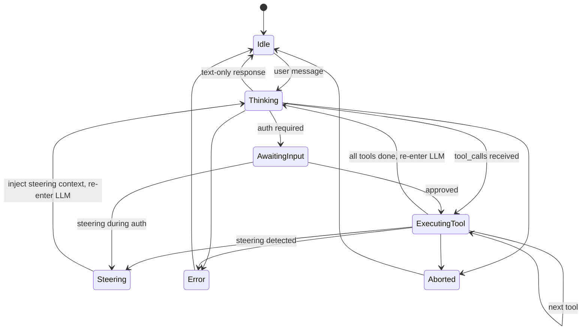

# Enhanced Agent Loop 需求评估报告

> **评估对象**: [Requirement_2026_02_10_Enhanced_Agent_Loop.md](file:///d:/Projects/Geni/docs/Requirement_2026_02_10_Enhanced_Agent_Loop.md)
> **评估基线**: 当前 [AgentRuntime.ts](file:///d:/Projects/Geni/src/main/services/agent/AgentRuntime.ts)、[AgentController.ts](file:///d:/Projects/Geni/src/main/controllers/AgentController.ts)、[AgentState.ts](file:///d:/Projects/Geni/src/main/services/agent/state/AgentState.ts)、[ToolGuard.ts](file:///d:/Projects/Geni/src/main/services/agent/ToolGuard.ts)、[IAgent.ts](file:///d:/Projects/Geni/src/main/services/agent/IAgent.ts) 等实际代码

---

## 一、总体评价

需求文档**方向正确**，三个核心目标（统一事件流、实时干预、可中断工具链）都是当前架构痛点的精准命中。特别是为即将到来的 WebSocket Gateway 铺路的动机非常清晰。

但文档目前更偏"概念设计"层面，在**落地细节、边界条件、以及与现有代码的融合策略**上存在多处需要补充的地方。以下按维度逐一分析。

---

## 二、逐项深度分析

### 🔴 1. `AgentEvent.payload` 类型安全

**问题**: 文档中 `payload: any` 破坏了 TypeScript 的类型安全承诺。

```typescript
// 文档方案 ❌
export interface AgentEvent {
    type: AgentEventType;
    payload: any; // 这让 "强类型的单一事件管道" 名不副实
}
```

**建议**: 使用**辨识联合类型 (Discriminated Union)** 替代，让每个事件类型都有明确的 payload 结构：

```typescript
// 改进方案 ✅
export type AgentEvent =
    | { type: 'agent_start'; timestamp: number; sessionId: string; payload: { taskDescription?: string } }
    | { type: 'message_delta'; timestamp: number; sessionId: string; payload: { delta: string; isReasoning?: boolean } }
    | { type: 'tool_start'; timestamp: number; sessionId: string; payload: { toolCallId: string; toolName: string; args: Record<string, any> } }
    | { type: 'tool_update'; timestamp: number; sessionId: string; payload: { toolCallId: string; progress?: number; output?: string } }
    | { type: 'tool_end'; timestamp: number; sessionId: string; payload: { toolCallId: string; result: string; isError: boolean; duration: number } }
    | { type: 'steering_detected'; timestamp: number; sessionId: string; payload: { newMessage: string; skippedTools: string[] } }
    | { type: 'auth_request'; timestamp: number; sessionId: string; payload: { requestId: string; toolName: string; args: any; reason: string } }
    | { type: 'agent_end'; timestamp: number; sessionId: string; payload: { finalAnswer: string; totalSteps: number } }
    | { type: 'error'; timestamp: number; sessionId: string; payload: { message: string; category?: string } };
```

这样前端的 Event Switch 才能享受到编译时的类型检查。

---

### 🔴 2. Steering 机制的边界条件未定义

文档描述了"在 tool 执行前检查蓄水池"的 happy path，但以下关键场景**完全缺失**：

| 场景 | 问题 | 建议 |
|:-----|:-----|:-----|
| **LLM 流式输出中途干预** | Steering 只在内循环（工具执行前）设置检查点，但如果用户在 LLM 正在 streaming 时插话呢？当前方案会等到所有 tool_calls 解析完毕后才检查，延迟可能很大 | 在 [executeLlmTurn](file:///d:/Projects/Geni/src/main/services/agent/AgentRuntime.ts#310-404) 的 `for await` 循环中也加入 steering 检查点（每 N 个 chunk 轮询一次） |
| **正在等待授权时干预** | 用户在 `AwaitingInput` 状态下发了新消息 | 应立即取消授权等待，转入 steering 流程 |
| **已执行部分工具后干预** | 假设计划执行 3 个工具，执行完 2 个后用户插话 | 需要定义：已执行工具的结果是保留还是丢弃？建议**保留已完成的，跳过剩余的** |
| **连续多次 Steering** | 用户快速连续发送多条消息 | 蓄水池应该**合并/只取最新**，避免队列堆积 |
| **Steering 消息与普通新对话的区分** | 如何判断用户的新输入是 steering（纠偏）还是想开启一个全新话题？ | 建议：Agent 运行中的输入一律视为 steering，Agent Idle 状态下的输入是新对话 |

---

### 🔴 3. 状态机需要同步演进

当前 [AgentState.ts](file:///d:/Projects/Geni/src/main/services/agent/state/AgentState.ts) 定义了 7 个状态。Steering 机制引入后，状态图需要扩展：



**需补充**：
- 新增 `Steering` 状态（或复用 `Thinking` 但带不同 metadata）
- 更新 [isValidTransition](file:///d:/Projects/Geni/src/main/services/agent/state/AgentState.ts#129-179) 规则表
- 状态转换的合法路径清单需要在文档中明确

---

### 🟡 4. [IAgentService](file:///d:/Projects/Geni/src/main/services/agent/IAgent.ts#28-39) 接口需要重大重构

当前 [IAgent.ts](file:///d:/Projects/Geni/src/main/services/agent/IAgent.ts) 的 [run()](file:///d:/Projects/Geni/src/main/services/agent/IAgent.ts#29-36) 签名是散装回调风格：

```typescript
// 当前 ❌
run(prompt, tools, options?, onStream?, onStepUpdate?): Promise<AgentRunResult>
```

统一事件流要求改为：

```typescript
// 目标 ✅
run(prompt, tools, options?, emit: (event: AgentEvent) => void): Promise<AgentRunResult>
```

**但文档没有讨论**：
1. [AgentRunResult](file:///d:/Projects/Geni/src/main/services/agent/IAgent.ts#22-27) 是否还需要？如果所有信息都通过 `emit` 推送，可能只需返回 `{ success: boolean }`
2. 返回值中的 `steps` 和 `newMessages` 是否改由事件流推送？这直接影响 Session 持久化逻辑
3. 旧的 `onStream` 回调中 [reset](file:///d:/Projects/Geni/src/main/services/agent/state/AgentState.ts#122-128) 语义如何映射到事件模型

**建议**: [AgentRunResult](file:///d:/Projects/Geni/src/main/services/agent/IAgent.ts#22-27) 简化为状态摘要，详细数据全部走事件流。Session 持久化改为在 Controller 层聚合事件。

---

### 🟡 5. 与 [AgentController](file:///d:/Projects/Geni/src/main/controllers/AgentController.ts#20-298) 的适配策略不够详细

当前 [AgentController.ts](file:///d:/Projects/Geni/src/main/controllers/AgentController.ts) 做了大量工作：
- IPC 节流 (`THROTTLE_MS = 60`)
- Stream 缓冲合并
- Steps 去重（只发最新状态）
- 授权桥接
- Session 持久化

文档 Phase 3 提到"增设向后兼容层"，但**具体适配方案缺失**：

| 现有功能 | 新架构中的归属 | 需要讨论 |
|:---------|:-------------|:---------|
| IPC 节流 | 应留在 Controller 层 | ✅ 无需变动 |
| Stream 缓冲 | 由 `message_delta` 事件驱动 | 需要改写缓冲逻辑 |
| Steps 聚合 | 由 `tool_start/tool_end` 事件驱动 | Controller 需要维护步骤状态 |
| 授权桥接 | 由 `auth_request` 事件驱动 | 改为事件+响应模式 |
| Session 持久化 | Controller 聚合事件流后写入 | 需要事件→消息的映射器 |

**建议**: 在 Phase 3 中明确定义一个 `AgentEventToIpcAdapter` 类，职责单一：将 `AgentEvent` 流翻译为旧 IPC 协议。

---

### 🟡 6. Steering Queue 的所有权与并发安全

文档说 "在网关层或 `SessionManager` 中" 放置 Steering Queue，但这个 **"或"** 需要变成确定的决策：

| 方案 | 优点 | 缺点 |
|:-----|:-----|:-----|
| **SessionManager 内** | 与 Session 生命周期绑定，自然隔离 | 运行时需要传入管道，增加耦合 |
| **AgentRuntime 内** | 执行时直接可访问，最简 | 需要外部注入消息的通道 |
| **独立 SteeringBus 服务** | 最解耦，Gateway/IPC/CLI 都通过同一接口注入 | 多一层抽象 |

**建议**: 采用"注入式"方案——在 [AgentRunOptions](file:///d:/Projects/Geni/src/main/services/agent/IAgent.ts#10-18) 中传入一个 `getSteeringMessages: () => string[]` 函数（文档已提到但未详细定义），让 Runtime 在检查点调用。外部（Controller/Gateway）负责调用对应方法往队列塞消息。

```typescript
interface AgentRunOptions {
    // ... existing fields
    steeringQueue?: {
        peek: () => string | null;  // 非阻塞查看
        drain: () => string[];       // 取出所有待处理消息
    };
}
```

---

### 🟡 7. 工具执行并发策略的细化

文档说"告别盲目的 `Promise.all`"，但当前代码实际上已经是**逐一串行执行** (`for...of` 循环)：

```typescript
// 当前 AgentRuntime.ts:419 - 已经是串行的
for (const tc of toolCalls) {
    // ... 逐一执行
}
```

所以"告别 Promise.all"的说法与现状不符。需要明确的是：
1. **当前已经是串行**，"可中断工具链"实际上已部分实现（通过 `signal.aborted` 检查）
2. 真正要补充的是：在每次工具执行前加入 **Steering 检查点**
3. 是否需要引入**受控并发**（例如：只读工具可并行，写入工具串行）？这是一个可以推迟的决策

---

### 🟡 8. 伪造工具返回值的格式标准化

文档中的 mock result 格式：
```
[System]: Tool execution skipped. The user interrupted with a new message: "{最新指令}"
```

需要进一步标准化：

1. **前缀应与现有 `[System Note]` 保持一致**（当前代码中用的是 `[System Note]`）
2. **被跳过的工具是否应该在 messages 中保留 tool_call 记录？** OpenAI API 要求 assistant 的 `tool_calls` 字段中每个工具都有对应的 [tool](file:///d:/Projects/Geni/src/main/services/agent/AgentRuntime.ts#462-475) role 回复，否则会报错。所以**必须为每个被跳过的工具生成一条 tool result 消息**
3. **Anthropic API 的兼容性**：Anthropic 的 tool_use/tool_result 协议也有类似约束

```typescript
// 标准化伪结果
function createSkippedToolResult(toolCallId: string, steeringMessage: string): ChatMessage {
    return {
        role: 'tool',
        tool_call_id: toolCallId,
        content: `[System Note] Tool execution was skipped because the user sent a new instruction: "${steeringMessage}". Please adjust your plan accordingly.`
    };
}
```

---

### 🟡 9. Event Sourcing 的程度界定

文档提到 Event Sourcing 但未界定"用到什么程度"：

| 级别 | 描述 | 代价 |
|:-----|:-----|:-----|
| **Level 1: 审计日志** | 所有 AgentEvent 写入持久化日志 | 低，只需 append-only 写入 |
| **Level 2: 可重播** | 从事件日志可完整重建 Session 状态 | 中等，需要严格的事件幂等性 |
| **Level 3: 完整 CQRS** | 读写分离，事件是唯一真实源 | 高，架构复杂度大增 |

**建议**: 当前只做 **Level 1**（审计日志）。Level 2/3 是 YAGNI。

---

### 🟡 10. 对前端的影响评估缺失

文档关注点全在后端，但前端影响不小：

1. **`useChatStore`** 需要适配新事件模型，当前它依赖 `agent:stream` 和 `agent:step`
2. **Steering UI 交互**：用户在 Agent 运行中输入时，前端应该有怎样的视觉反馈？（例如显示"正在调整方向..."的状态指示）
3. **授权面板**：如果 Steering 取消了正在等待授权的工具，UI 需要自动关闭授权弹窗
4. **Step 展示逻辑**：被 steering 跳过的工具步骤应如何展示？建议显示为灰色 + "已跳过" 标记

---

### 🟢 11. 测试策略缺失

文档的 Implementation Roadmap 中**没有测试计划**。对于核心引擎重构，这是高风险的。

**建议补充**：
- **单元测试**: Steering Queue 的 peek/drain 语义、伪结果生成器
- **集成测试**: 模拟 LLM → Tool Chain → Steering 打断 → 恢复 的完整流程
- **回归测试**: 确保无 Steering 时的行为与旧版本完全一致
- **压力测试**: 快速连续 Steering 消息不会导致状态混乱

---

### 🟢 12. 渐进式迁移路径

文档的 3 Phase 路线图合理但偏理想化。建议补充一个**更安全的渐进策略**：

```
Phase 1a: 定义 AgentEvent 类型 (纯类型，不改运行时)
Phase 1b: 在 AgentRuntime 中引入 emit() 但同时保留旧回调 (双写期)
Phase 2a: 实现 Steering Queue (独立模块，可独立测试)  
Phase 2b: 在工具循环中植入检查点 (最小侵入式)
Phase 3a: AgentController 适配层 (将 emit() 翻译回旧 IPC)
Phase 3b: 前端适配（可选：直接消费新事件 or 通过适配层）
Phase 4:  移除旧回调 (确认全链路走新事件后)
```

---

## 三、优先级建议

| 优先级 | 项目 | 理由 |
|:-------|:-----|:-----|
| 🔴 P0 | Event 类型安全 (§1) | 架构基石，一旦 `any` 扩散就很难收回 |
| 🔴 P0 | Steering 边界条件 (§2) | 不定义边界条件直接编码会导致大量返工 |
| 🔴 P0 | 伪造 tool result 格式 (§8) | 影响 OpenAI/Anthropic API 兼容性 |
| 🟡 P1 | 状态机演进 (§3) | Steering 需要状态支撑 |
| 🟡 P1 | IAgentService 接口 (§4) | 核心接口变更影响面大 |
| 🟡 P1 | Steering Queue 归属 (§6) | 架构决策需提前确定 |
| 🟡 P1 | 测试策略 (§11) | 核心引擎重构必须有测试保障 |
| 🟢 P2 | Controller 适配 (§5) | 可在实现时细化 |
| 🟢 P2 | 前端影响 (§10) | 可与前端同事平行讨论 |
| 🟢 P2 | Event Sourcing 程度 (§9) | 当前做 Level 1 即可 |
| 🟢 P2 | 渐进迁移路径 (§12) | 降低风险的保护机制 |

---

## 四、总结

> [!IMPORTANT]
> 这份需求方案**方向完全正确**，三大目标（统一事件流、Steering、可中断工具链）精准对应了当前架构瓶颈。核心设计思路（双循环结构 + 蓄水池检查点）简洁优雅。

> [!WARNING]
> 主要风险在于**细节不足**：`payload: any` 的类型退化、Steering 边界条件缺失、伪造 tool result 与 LLM API 的兼容性未考虑。这些不解决就直接编码，大概率会在集成阶段返工。

**建议**: 先将上述 P0 项补充到需求文档中，**特别是 §1 类型安全和 §2 边界条件**，然后再进入编码阶段。
